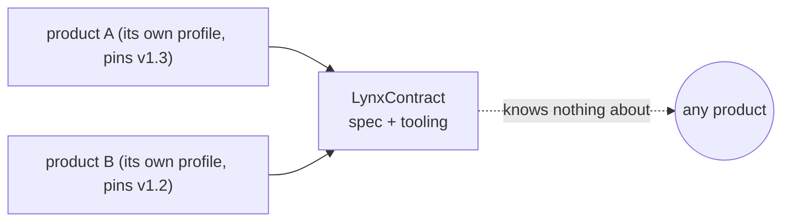

# LynxContract

**LynxContract gives the developer back control over LLM code generation by tying every change
to a contract, a requirement, and a check.** Models already write code well; what we lack is
causality, boundaries and verifiability for that code. This repo is one answer, as a full loop:
**contract → provenance graph → generation → independently derived tests → drift
classification → contract-level snapshots** — with exactly one citation-gated write path for
agents.

> Git records *what changed*. LynxContract records *why the code exists at all*.

Three things carry the whole system:

1. **`lynx_why`** — ask why a specific generated line exists; the answer is a graph path
   (method → contract → rule → requirement), not model prose.
2. **The contract is the shared source for code *and* tests** — assertions are read off the
   contract keys, never off what the code happens to do, so a test cannot quietly bless a bug.
3. **Honesty over completeness** — when contracts run out, the generator records a gap and
   marks the spot instead of plausibly inventing the missing piece; every later divergence is
   classifiable as predicted, catalogued, or a defect.

Everything else — the `//@` grammar, the archetype layer, the MCP tools, the LSP — exists to
make those three mechanical.

Invented and maintained by Dmitry Serikov. The language dates to **v0.2, 2025-07-05** — the
original Python/Go spec first published in
[`dimaq12/lambda`](https://github.com/dimaq12/lambda/blob/main/docs/spec.lynx.md); this
repository's `heritage/` carries that edition, and everything here evolved from it. This is the
language's standalone home — the spec, the tooling, and the method. Products consume it by
pinning a spec version; nothing here depends on any particular product.

## The dependency arrow points one way

**A product depends on LynxContract the way it depends on any MIT library: by pinning a
version. LynxContract depends on no product — by construction, not by promise.**

- **Core vs profile.** The language core (§1–§17) is generic. Everything project-specific —
  real topic conventions, schema registries, test stacks — lives in a *profile* the host keeps
  in its own repository. §18 shows a complete worked profile for the fictional Acme platform;
  that is what yours looks like, on your side of the fence.
- **Bindings never flow back.** The skills ship as language-level canon with `<org>`/`<kb>`
  placeholders; a host binds them by keeping thin copies that pin its real upstream sources,
  stacks and paths. Nothing a host writes ever lands here.
- **Fictional by gate, not by luck.** Every example, fixture and test in this repo is invented
  (Acme/CoreLab/Atlas) — an enforced invariant, not a convention: the contribution gate greps
  for non-fictional product references and must stay at zero.
- **Migration is deliberate.** Minors are additive; a host moves to a new spec version when it
  chooses, like any dependency bump — the language never reaches into a product to break it.



## What's in the box

| Path | What |
|---|---|
| `COOKBOOK.md` | **Start here.** 21 practical recipes with exact syntax: first contract → Kafka unit → contract-derived tests → family archetype → honesty protocol → the graph, CI, snapshots and diff. |
| `spec/lynxcontract-spec-kotlin-java-v1.3.md` | The current spec (JVM edition). Language-agnostic core (§1–§17), an example project profile (§18), and the **Archetype & Template Profile** (§20) — the layer that turns contracts into reusable family templates with fills, multipliers, provenance markers and mechanical lint invariants. |
| `spec/lynx-graph-mcp-spec-v1.0.md` | **Lynx Graph** — the contract↔code index served over MCP: graph model, SQLite storage, and tool contracts (`schema`/`query`/`why`/`impact_of`/`explain_divergence`/…) that let an agent see the coupling instead of grepping text; includes the monorepo hologram (the organization’s declared event mesh, layers, ownership and compat surfaces as one queryable graph) and, since v1.0, the operational time axis — a content-addressed snapshot registry behind `snapshots`/`diff` — plus line-shift-immune content-hash ids. Shipped: the reference implementation is `tools/graph/`. (History: v0.2 design in git.) |
| `tools/graph/` | **Lynx Graph v1.0, shipped**: shared parser (`@lynx/core`), deterministic SQLite indexer (+ watch mode, shard caches, `lynxctl` CI linter), and the stdio MCP server — 18 tools, 85 contract-derived tests. |
| `tools/vscode/` | VS Code extension: syntax highlighting, semantic tokens, snippets, and a full LSP server (diagnostics follow the spec's static checks). Buildable to VSIX. |
| `skills/` | The method as agent procedure: two foundation skills (`contract-first`, `family-archetype`) plus one mode skill per product moment — `module-design` (greenfield), `module-refactor` (one-off restructuring), `instantiation-run` (one full template run: plan → waves → self-lint → diff). Language-level canon with `<org>`/Acme placeholders; host projects bind via thin copies. |
| `heritage/` | The original Python/Go spec (v0.2) the JVM edition was ported from. |
| `HISTORY.md` | How the language evolved: v0.2 (2025-07-05, Python/Go) → v1.3-jvm + Lynx Graph v1.0, and the battle-run record that shaped §20. |
| `ROADMAP.md` | Shipped components (`lynxctl`, the MCP graph index), remaining tooling gaps, and spec v1.4 candidates. |

## The three jobs it does

LynxContract answers three product moments — everything in this repo (spec, skills, graph)
exists to serve one of them:

| # | The moment | The move | Where |
|---|---|---|---|
| 1 | **"Build me a new module"** | Write the contract skeleton first (§8) — rich enough that an agent generates the implementation *and* the contract-tests from it, inventing nothing (§7 determinism). | `skills/module-design` · `skills/contract-first` Phase 1 · cookbook 1–5 |
| 2 | **"Change / refactor this module"** | Contracts move first, across the whole affected tree; code is brought into compliance (never the reverse). The graph shows what to regenerate (`impact_of`), who breaks (`org_impact_of`), and where code already disagrees (`drift`). | `skills/module-refactor` · `skills/contract-first` Phase 2–3 · cookbook 15, 17–19 |
| 3 | **"Re-instantiate this template under new requirements"** | The family archetype: new requirements land as **fills** in declared variation points; a requirement that fits no variation point is a template-evolution request, not an improvisation. A new member is a configuration, never a fork. | `skills/family-archetype` → `skills/instantiation-run` · cookbook 6–11 |

## Quick start

**Write your first contract** — open `COOKBOOK.md`, recipe 1. It is a comment block; there is
nothing to install:

```kotlin
//@contract: CaptureMapper.toEvent
//@  signature: fun toEvent(response: RawCapture): CaptureStarted
//@  pre: response.id.isNotBlank()
//@  post: result.captureId == response.id
//@  assigns: []
```

**Run the graph** — index a workspace and serve it to your agent over MCP:

```bash
cd tools/graph && npm install && npm run build && npm test
node indexer/out/cli.js --config lynx-sources.json --out /tmp/my.db --snapshot
node mcp-server/out/server.js --db /tmp/my.db --sources lynx-sources.json
```

Any MCP client then gets 18 tools: `lynx_schema` / `lynx_query` (arbitrary read-only SQL),
`lynx_why` / `lynx_impact_of` / `lynx_org_impact_of` (provenance and blast radius),
`lynx_lint` / `lynx_drift` / `lynx_explain_divergence` (discipline, fidelity, the trichotomy),
`lynx_hologram` / `lynx_snapshots` / `lynx_diff` (the org event mesh and its time axis), and
`lynx_propose_change` (the one guarded write path). Details: `tools/graph/README.md`.

**Install the editor support** — `tools/vscode/` builds to a VSIX: highlighting, semantic
tokens, diagnostics that follow the spec's static checks.

## Seven words you need (the rest is detail)

| Term | Meaning |
|---|---|
| **contract** | a `//@` block stating what a unit must do: signature, pre/post, errors, topics — rich enough to regenerate the code |
| **stub** | a template file: a contract plus `TARGET` (where the code will land) and `REALIZATION` (how it comes to exist) |
| **fill** | a declared variation point (`{{Token}}`) — the only legal way family members may differ |
| **instantiation** | one concrete member of a family: a manifest of fill values applied to the template |
| **gap / marker** | the honesty mechanism: a recorded "contracts didn't cover this" ledger entry + the spot in code it explains |
| **drift** | where contract and code currently disagree — code no contract knows, declarations nothing realizes |
| **snapshot** | a content-addressed copy of the graph at one generation, so `diff` answers "what changed, contract-level" |

## The core ideas, in five sentences

1. **Contract before code**: every module element carries a full `//@contract` (intent, rules,
   pre/post, calls, error routing) — sufficient for an agent to generate an equivalent
   implementation without inventing anything (§7 determinism).
2. **Archetype, not copy-paste**: a family of similar modules is written once as a template of
   contract stubs — the invariant shape is fixed, every legal difference is a declared,
   registered **fill**; a new member is an instantiation of a subset, never a fork.
3. **Closed surface**: a requirement that fits no declared variation point is not input — it is
   a template-evolution request or an "outside this family" verdict; the generating agent has no
   room to hallucinate because everything askable is enumerable.
4. **Honesty protocol**: when contracts are insufficient the generator STOPS, records the gap,
   takes a cited conservative reading and marks the spot — so an adversarial diff later
   classifies every divergence as predicted, catalogued, or a genuine defect (the "trichotomy").
5. **Checks measure presence, count and cross-reference — never content fidelity**: that last
   mile is closed only by execution (compile, run the generated tests, verify against recorded
   real exchanges). A template whose checks all pass has earned a build, not a deployment.

## Battle-tested

The archetype profile is not speculative: it was hardened by **six full isolated instantiation
runs** of the adapter-family template — a fresh agent session each time, rebuilding a whole
multi-hundred-file module family from contracts alone under the honesty protocol, followed by an
adversarial diff.
The counts differ by document on purpose: runs 1–2 proved the v1.2 template layer, runs 1–5
supplied the lessons folded into v1.3 (which is why the spec header says "five"), and run 6 was
a verification pass on the near-frozen template measuring inter-session variance — the
text-iteration asymptote. Grouped defect root causes fell roughly **threefold** across the runs
before flattening out. Nearly every §20 rule — the completion-check family, marker hygiene,
remediation rigor, wire-true literal precedence, the roster-disagreement rule — exists because a
specific run demonstrated the specific failure it prevents. The run-by-run record:
`HISTORY.md`.

## Versioning

The spec is additive across minor versions; products pin a version and migrate deliberately.
Current: **v1.3-jvm** (2026-07-23). History: v0.2 (Python/Go core) → v1.0 (JVM port) → v1.1
(field-proven contract-first patterns) → v1.2 (+§20 archetype profile, `drop` error route) → v1.3
(+battle-run discipline: completion checks 8–10, marker hygiene, remediation rigor, wire-true
precedence, instance-source unions).

## Acknowledgements

Some of the thinking here was sparked by adjacent work on contract-driven agent engineering:
[GRACE](https://github.com/osovv/grace-marketplace) (Graph-RAG Anchored Code Engineering —
agent skills with explicit module contracts, verification planning and knowledge-graph
navigation) and Vladimir Ivanov's [@turboplanner](https://t.me/turboplanner) notes, where some
of those ideas come from.

## License

MIT — see `LICENSE`.
